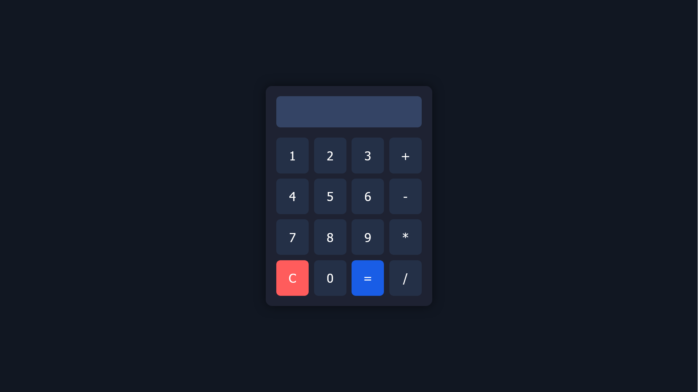

# Calculator Web App - CodeSoft Level 1 Task 1 Project

## Project Overview
This is the first task for **CodeSoft Level 1**. It is a basic calculator that allows users to perform simple arithmetic operations such as addition, subtraction, multiplication, and division. The design is fully responsive, ensuring it works well across various devices, including mobile, tablet, and desktop. The calculator also supports keyboard inputs for more efficient usage.

## Features
- **Arithmetic Operations**: Performs addition, subtraction, multiplication, and division.
- **Responsive Design**: Optimized for mobile, tablet, and desktop devices.
- **Keyboard Support**: Users can interact with the calculator using the keyboard.
- **Error Handling**: Displays real-time feedback and handles invalid inputs gracefully.

## Technology Stack
- **HTML**: The structure and layout of the calculator.
- **CSS**: Styling and responsive design elements.
- **JavaScript**: Implements calculator logic and keyboard input functionality.

## Screenshots

### Main App Screen


## Getting Started
To run the calculator locally, follow these steps:

### Step 1: Clone the repository
```bash
git clone https://github.com/MoSalem149v2/calculator-web-app_CodeSoft-Level_1-Task_1-Project.git
